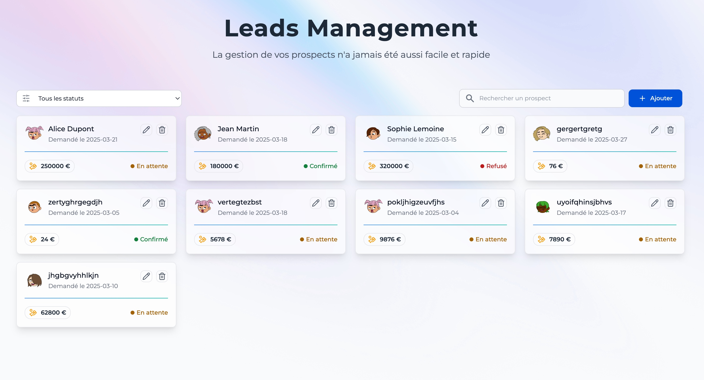

# Gestion des Leads - Application JavaScript

## Aperçu de l'application


## Description
Cette application permet de gérer une liste de demandes de financement (leads) avec plusieurs fonctionnalités :

- Affichage de la liste des leads à partir d'un JSON simulé.
- Filtrage des leads par statut (En attente, Confirmé, Refusé).
- Modification du statut d'un lead.
- Ajout manuel d'un lead avec un formulaire (statut initial "En attente").
- Suppression d'un lead.
- (Bonus) Recherche par nom dans la liste.
- (Bonus) Stockage des données en `localStorage` pour persister après un rafraîchissement.

## Démo en ligne
[Accéder à la démo en ligne](https://prospectify.netlify.app/)

## Installation et exécution du projet

### 1. Cloner le projet
```bash
git clone https://github.com/CodeShadowing95/prospect-management.git
cd prospect-management
```

### 2. Installer les dépendances (si applicable)
Si vous utilisez un gestionnaire de paquets comme `npm` ou `yarn` :
```bash
npm install  # ou yarn install
npm run dev
```